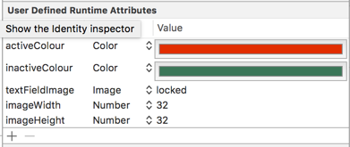

# ACAnimatedTextField

ACAnimatedTextField is a subclass of UITextField which replaces a text placeholder with an image.

## Installation
ACAnimatedTextField is one file, simply drag and drop `ACAnimatedTextField/ACAnimatedTextField.swift` into your project and set the class of a UITextField to ACAnimatedTextField

## Preview


## Customization
4 things are currently able to be customized.

- Image
- Active colour
- Inactive colour
- Size of UIImageView

You can either set them via code or user attributes

### Interface Builder


### Code
```swift
demoTextField.activeColour = UIColor.redColor()
demoTextField.inactiveColour = UIColor.greenColor()
demoTextField.textFieldImage = UIImage(named: "locked")
demoTextField.imageWidth = 24
demoTextField.imageHeight = 24
```

## Todo

- [ ] Make textRect change based on size of UIImageView

## License
ACAnimatedTextField is under the MIT license. Please check out LICENSE.md for more information
